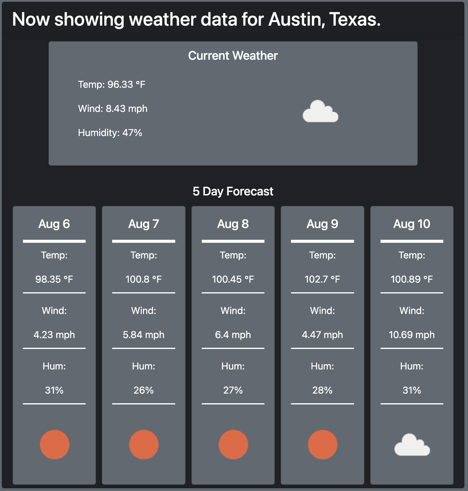

# Weather Tracker

## Description
This application will allow the user to search various cities accross the United States and collect weather data for each city.

## Usage
The user will type in the name of a city and the state and upon clicking "search" the application will retreive weather data. 

It will collect the current temperature, wind speed and humidity as well as the values for the next five days and display it on your screen.

After every search, the application will remember which cities you searched and create a quick select button so that the user can collect the data again. The same information will be displayed.

## Installation
No installation required

## Acknowledgements
Built with the following APIs
- Open Weather API
- jQuery
- DayJS
- Bootstrap